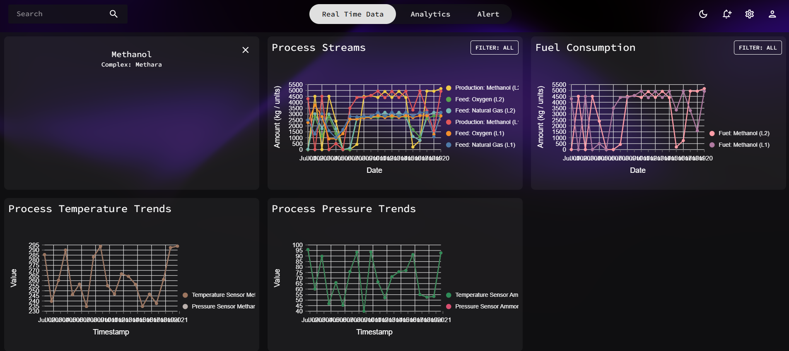
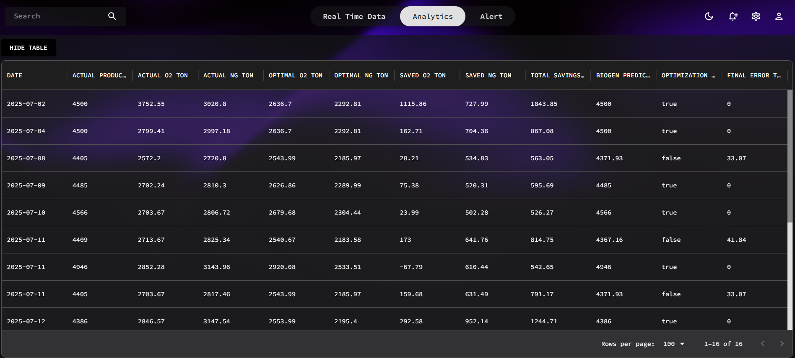

#  Smart Industrial Monitoring, Analytics & Optimization Platform (Demo)

Demo platform for **industrial process monitoring, analytics, and optimization**, demonstrated on **methanol and ammonia plants**, fully **extensible to other chemical or process-based industries**.

The platform collects operational data, normalizes it using **license constants and unit conversions**, and computes **key performance indicators (KPIs)** such as feed ratios, energy metrics, efficiency, and resource deviations.  
Using **flag-based monitoring**, it enables **real-time tracking of thresholds and alerts**, forming an intelligent **energy and resource control system**.

---

## Overview

This platform unifies **real-time process monitoring**, **data-driven analytics**, and **optimization algorithms** to deliver **actionable operational insights**.

Its modular structure supports multiple industrial contexts, enabling **predictive Business Intelligence (BI)** and **Business Analytics (BA)** capabilities for **efficiency improvement** and **decision support**.

### Key Functionalities

- Real-time **feed ratio tracking** and sensitivity analysis  
- **Energy consumption monitoring** with deviation flags and efficiency scores  
- Identification of **bottlenecks and limiting factors** in resource utilization  
- **KPI-driven insights** for process optimization and strategic decisions  
- Integration-ready foundation for **industrial analytics dashboards** and **optimization control layers**

---

## System Architecture

| Layer              | Description                                                                                                                                                |
| ------------------ | ---------------------------------------------------------------------------------------------------------------------------------------------------------- |
| **Database**       | PostgreSQL storing structured data, computed KPIs, and hierarchical process-unit relationships                                                             |
| **Backend**        | Python-based REST API (FastAPI) handling KPI computation, analytics, and optimization logic (implemented with gplearn/genetic algorithms)                  |
| **Authentication** | Keycloak + JWT: ① Frontend authenticates with Keycloak → ② JWT issued → ③ Sent with each request → ④ Backend validates via Keycloak before serving data |
| **Frontend**       | React + Material UI providing interactive dashboards, real-time visualization, and alert management                                                        |

---

## Core Features

- **Feed Ratio & Resource Analytics** → Understand input proportion impacts on production and efficiency  
- **Energy Control System** → Monitor energy intensity and deviation patterns using color-coded alerts  
- **KPI-Driven Decision Support** → Enable smarter operational choices from dynamic metrics and trends  
- **Optimization Engine** → Employ **genetic/evolutionary algorithms** (gplearn) for operational adjustment recommendations  
- **Secure RESTful APIs** → Robust, token-based, and parameterized endpoints for analytics requests  
- **Hierarchical Asset Management** → Structured view of equipment, processes, and KPI aggregation  
- **Modular Extensibility** → Easily adaptable to new plants, products, or industrial domains

---

## Optimization & Analytics Logic

The backend provides a **computational intelligence layer** that:

- Computes **feed ratio sensitivity**, **energy intensity**, and **process efficiency metrics**  
- Implements **evolutionary optimization** to propose **resource-efficient operation strategies**  
- Derives **optimal setpoints** and **target efficiencies** based on KPI-driven fitness criteria  
- Enables **predictive modeling** through BI/BA integration for higher-level insights

> Optimization is **largely guided by measurable plant behavior**, which can be understood through **mathematical and biological reasoning**, helping to achieve **operational realism** and **actionable output**.

---

## Future Expansion

The platform is designed to support additional capabilities in future versions:

- **IIoT Environments** → Integration with real-time sensor and telemetry data  
- **DCS / Automation Systems** → Closed-loop optimization and control feedback  
- **Energy & Resource Alert Modules** → Advanced threshold management and automated mitigation  
- **Vector Databases / AI Analytics** → For similarity-based querying and professional reporting  
- **Graph Databases (Neo4j)** → Process and asset relationship modeling  
- **Digital Twin Integration** → Simulation-driven optimization and scenario testing  
- **Maintenance & Reliability (PM/WO / CMMS)** → Integration with professional maintenance management and functional location hierarchies
- **Energy Management (EMS)** → Extendable toward enterprise-level energy monitoring and control systems

> These extensions enable the platform to evolve into a **complete industrial intelligence ecosystem**, merging monitoring, optimization, and control under one framework, but they are **not part of the current demo**.

---

## Tech Stack (Current Implementation)

| Layer               | Technology                                                 |
| ------------------- | ---------------------------------------------------------- |
| **Frontend**        | React + Material UI                                        |
| **Backend**         | Python (FastAPI)                                           |
| **Database**        | PostgreSQL (KPI + hierarchy models)                        |
| **Authentication**  | Keycloak + JWT                                             |
| **Data Processing** | Pandas, NumPy                                              |
| **Optimization**    | Genetic / gplearn algorithms                                |

---

## Screenshots

| Dashboard                                          | Analytics                                          | Optimization View                                     |
| -------------------------------------------------- | -------------------------------------------------- | ----------------------------------------------------- |
|  |  |  |

---

## Author

**Amirmahdi Bastani**  
Mathematics & Computer Science Student 
[Email](mailto:a@sharif.edu) [Email](mailto:amir.bastani1383@gmail.com)

